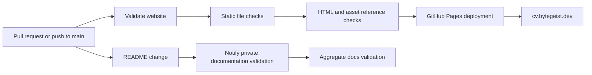

# my-digital-cv

Public technical portfolio for Dennis Kappel.

The current landing page positions Dennis around practical infrastructure
operations, k3s/Kubernetes learning through real systems, Git-backed runbooks,
observability, private access, and disciplined AI-assisted delivery.

## Capabilities

| Capability | What the repository demonstrates |
| --- | --- |
| Static web delivery | Lightweight HTML, CSS, and JavaScript portfolio with no build dependency. |
| Bilingual presentation | English canonical CV plus a manually reviewed German `/de/` experience. |
| Infrastructure portfolio | Practical evidence across Linux, containers, networking, monitoring, Kubernetes, and operations. |
| Evidence-led engineering | Runbooks, health checks, logs, metrics, Git diffs, and live service behavior over generated claims. |
| Private documentation integration | README changes can notify the aggregate validation workflow in `ffworker/bytegeist-docs`. |

## CI/CD Pipeline

Every change is checked before it becomes part of the public portfolio:

- **Validate website** checks the canonical English and German pages, required
  assets, the custom domain, and local absolute HTML/CSS/JavaScript references.
- **GitHub Pages** publishes the validated static site from `main` at
  [cv.bytegeist.dev](https://cv.bytegeist.dev).
- **Documentation notification** sends source repository, ref, and commit
  metadata to the private aggregate documentation validator when `README.md`
  changes. No document contents are sent by this workflow.

## Current Story

- Infrastructure-focused IT professional moving toward DevOps, SRE, platform
  engineering, and Kubernetes-focused work.
- Practical ownership across Linux hosts, VPS systems, Raspberry Pi
  infrastructure, containers, networking, service exposure, and monitoring.
- Evidence-led troubleshooting: logs, metrics, Git diffs, rollout state, health
  checks, and live service behavior matter more than generated output.
- AI is represented as a working method with clear verification boundaries, not
  as a replacement for technical judgment.

## Notes

- The current English CV landing page is `index.html`.
- The German CV lives at `de/index.html` and is served as `/de/`.
- Treat English as the canonical source. When English CV wording changes, review
  the diff and update `de/index.html` in the same commit. Do not rely on silent
  deploy-time machine translation for CV wording; German should stay natural and
  manually reviewed.
- `sites/projects.html` and `sites/skills.html` are older Bootstrap-era pages.
  They remain as historical learning snapshots, not as the primary CV.
- The strongest infrastructure evidence currently lives in the private
  `ffworker/infra-configs` repository and the live Bytegeist environment.
